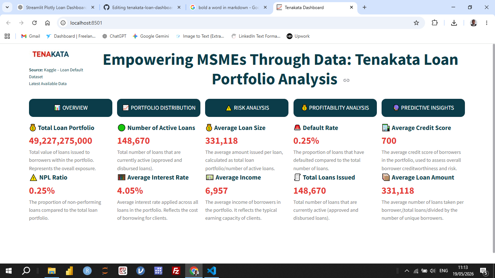
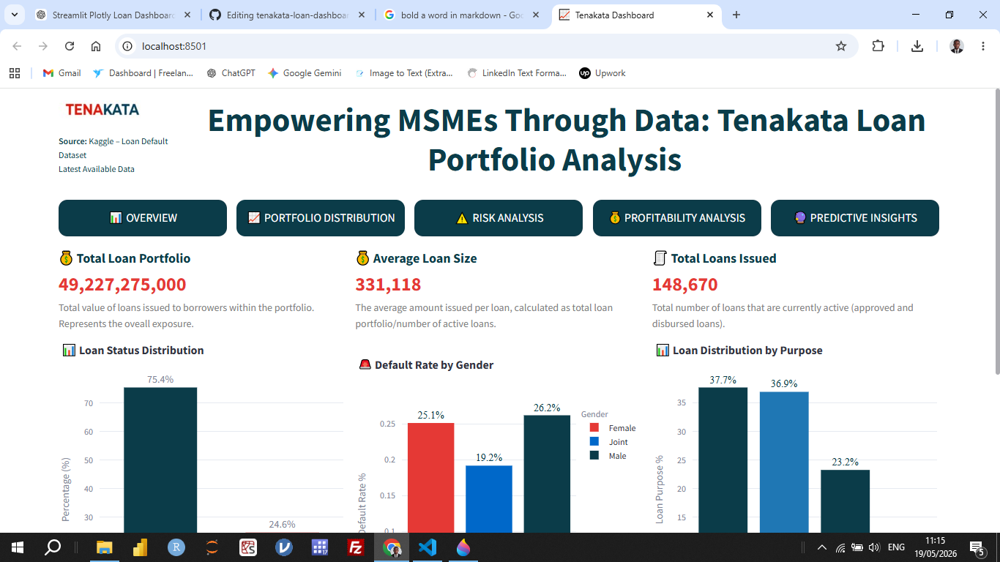
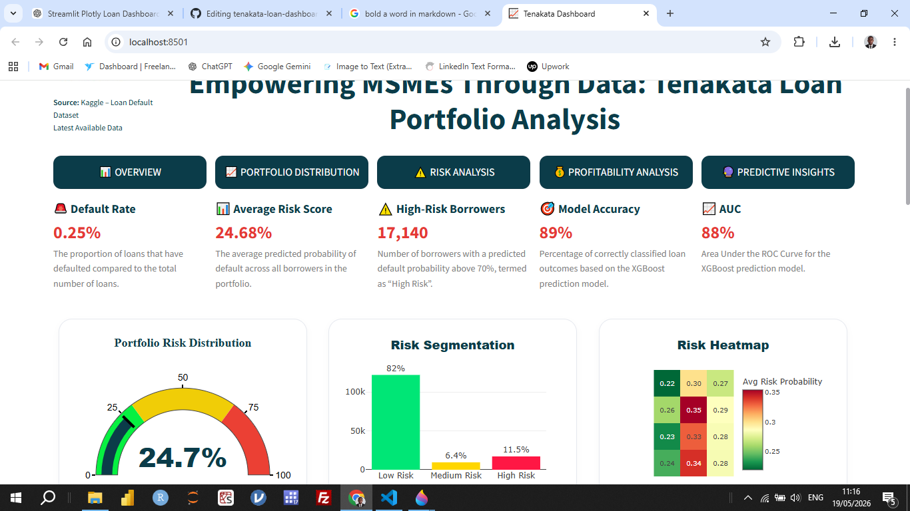
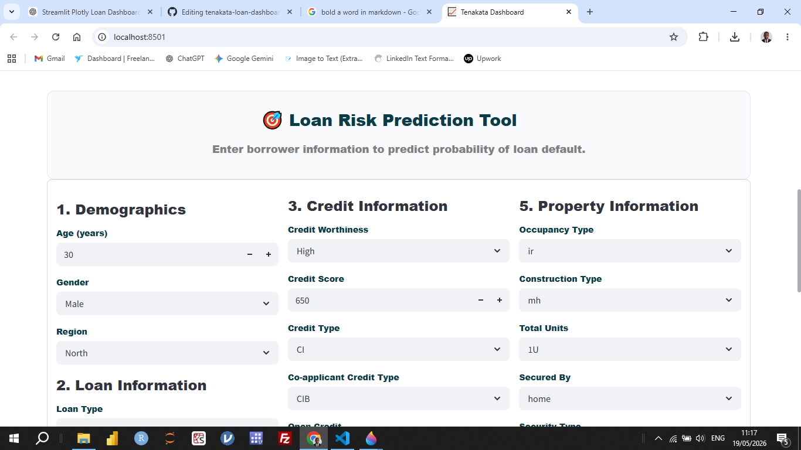

# Empowering MSMEs Through Data: Tenakata Loan Portfolio Analysis

## 🚀 Live Demo

Click below to explore the dashboard:`https://tenakata-loan-dashboard.streamlit.app/`

### Overview

**Empowering MSMEs Through Data: Tenakata Loan Portfolio Analysis** is an interactive data analytics and machine learning dashboard designed to provide actionable insights into MSME (Micro, Small, and Medium Enterprises) loan portfolios.

The project combines portfolio analytics, risk assessment, profitability analysis, and predictive modeling into a single Streamlit application to help stakeholders better understand loan performance, borrower behavior, and potential credit risk.

### Dataset

The dataset used in this project was obtained from Kaggle: https://www.kaggle.com/datasets/yasserh/loan-default-dataset 

The dataset contains loan-related and borrower-related features used for portfolio analysis, risk assessment, profitability analysis, and predictive modeling.

## Project Objectives

The main objectives of this project are to:

- Analyze MSME loan portfolio performance.
- Visualize borrower and loan distribution patterns.
- Identify high-risk segments within the portfolio.
- Evaluate portfolio profitability.
- Predict loan risk using machine learning.
- Support data-driven lending decisions.

## Dashboard Pages

The dashboard consists of five interactive pages:

### 1. Overview

The Overview page provides a high-level summary of the MSME loan portfolio.

#### Features
- Key Performance Indicators (KPIs)
- Total Loans Issued
- Total Borrowers

### 2. Portfolio Distribution

The Portfolio Distribution page explores how loans are distributed across different borrower and loan characteristics.

#### Features
- Key Performance Indicators (KPIs)
- Total Loan Portfolio
- Total Loans Issued
- Loan distribution by:
- Gender
- Purpose
- Loan status

#### Purpose

This page helps identify portfolio concentration patterns and understand how lending is distributed among MSMEs.

### 3. Risk Analysis

The Risk Analysis page focuses on identifying and analyzing risk within the portfolio.

#### Features
- Key Performance Indicators (KPIs):
- Average Credit Score
- Total High Risk Loans
- Average DTI Ratio
- Average LTV Ratio
- Credit Score Distribution:
- Box Plot
- Histogram
  
#### Purpose

This page supports better credit risk management by helping users identify risky segments and monitor portfolio health.

### 4. Profitability Analysis

The Profitability Analysis page evaluates the financial performance of the portfolio.

#### Features
- Key Performance Indicators (KPIs):
- Estimated Interest Revenue
- Average Interest Rate
- Average Upfront Charges
- Profitability Bubble Chart
- Loan Amount vs Interest Revenue

#### Purpose

This page helps stakeholders understand which loan segments generate the highest returns and how profitable the portfolio is overall.

### 5. Predictive Insights

The Predictive Insights page uses a machine learning model to predict loan risk.

#### Features
- XGBoost-based loan risk prediction
- Interactive borrower input form
- Real-time risk prediction
- Loan risk gauge chart
- Probability scoring
- Model-driven decision support
- Machine Learning Model

The dashboard uses an XGBoost Classifier trained on loan-related features to predict the probability of loan risk.

#### Purpose

This page helps simulate lending decisions by estimating the likelihood of loan risk based on borrower and loan characteristics.

## Technologies Used

### Programming Language
Python

###Frameworks & Libraries
- Streamlit
- Plotly
- Pandas
- NumPy
- Scikit-learn
- XGBoost
- Matplotlib
- Machine Learning
- XGBoost Classifier
- Feature Engineering
- Data Preprocessing
- Model Evaluation
- 
### Installation

#### Clone the Repository
`git clone https://github.com/thugge254/tenakata-loan-dashboard.git`

### Install Dependencies
`pip install -r requirements.txt`

### Run the Application
`streamlit run app.py`

## Screenshots

### Overview Page

### Portfolio Disrtribution Page

### Predictive Insights Page

### Loan Risk Prediction Section

### Risk Prediction Section

Example:
## Author
Moses Chege

#### Data Analyst | Data Scientist | BI & Analytics Enthusiast

#### Skills
- Python
- SQL
- Machine Learning
- Streamlit
- Data Visualization
- XGBoost
- Business Intelligence

### GitHub Repository:

https://github.com/thugge254/tenakata-loan-dashboard

#### License

This project is open-source and available under the MIT License.
